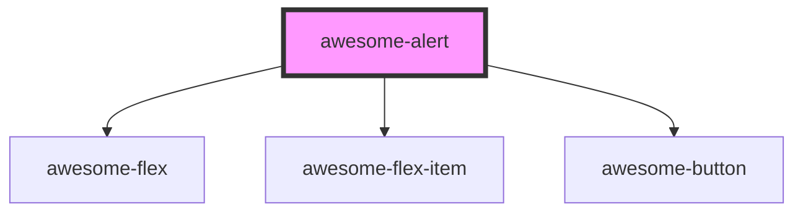

# awesome-alert

<!-- Auto Generated Below -->

## Properties

| Property  | Attribute | Description                                  | Type                      | Default                |
| --------- | --------- | -------------------------------------------- | ------------------------- | ---------------------- |
| `buttons` | --        | Button definitions of the alert.             | `AlertButtonDefinition[]` | `this.DEFAULT_BUTTONS` |
| `header`  | `header`  | Header of the alert.                         | `string`                  | `undefined`            |
| `hidden`  | `hidden`  | A flag to hide the alert. Default to `true`; | `boolean`                 | `true`                 |
| `message` | `message` | Message of the alert.                        | `string`                  | `undefined`            |
| `zIndex`  | `z-index` | `z-index` of the alert.                      | `number`                  | `this.DEFAULT_Z_INDEX` |

## Methods

### `present(header: string, message: string, buttons?: AlertButtonDefinition[], zIndex?: number, attachingElement?: string | globalThis.Element) => Promise<() => void>`

Present an aleret.

#### Returns

Type: `Promise<() => void>`

A funtion to dismiss the alert.

## Shadow Parts

| Part        | Description |
| ----------- | ----------- |
| `"header"`  |             |
| `"message"` |             |

## Dependencies

### Depends on

- awesome-flex
- awesome-flex-item
- [awesome-button](../awesome-button)

### Graph

----------------------------------------------

*Built with [StencilJS](https://stenciljs.com/)*
