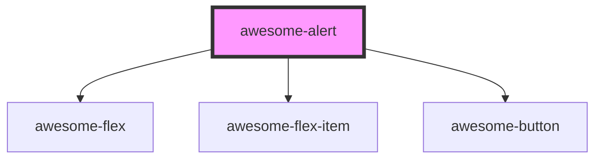

# awesome-alert

<!-- Auto Generated Below -->

## Properties

| Property  | Attribute | Description                                            | Type                      | Default                |
| --------- | --------- | ------------------------------------------------------ | ------------------------- | ---------------------- |
| `active`  | `active`  | If `true`, the alert is displayed. Default to `false`; | `boolean`                 | `false`                |
| `buttons` | --        | Button definitions of the alert.                       | `AlertButtonDefinition[]` | `this.DEFAULT_BUTTONS` |
| `content` | `content` | Content of the alert. It can be HTML string.           | `string`                  | `undefined`            |
| `header`  | `header`  | Header of the alert.                                   | `string`                  | `undefined`            |
| `zIndex`  | `z-index` | `z-index` of the alert.                                | `number`                  | `this.DEFAULT_Z_INDEX` |

## Methods

### `present(header: string, content: string, buttons?: AlertButtonDefinition[], zIndex?: number, attachingElement?: string | globalThis.Element) => Promise<() => void>`

Present an aleret.

#### Returns

Type: `Promise<() => void>`

A funtion to dismiss the alert.

## Shadow Parts

| Part        | Description |
| ----------- | ----------- |
| `"content"` |             |
| `"header"`  |             |

## Dependencies

### Depends on

- awesome-flex
- awesome-flex-item
- [awesome-button](../awesome-button)

### Graph

----------------------------------------------

*Built with [StencilJS](https://stenciljs.com/)*
