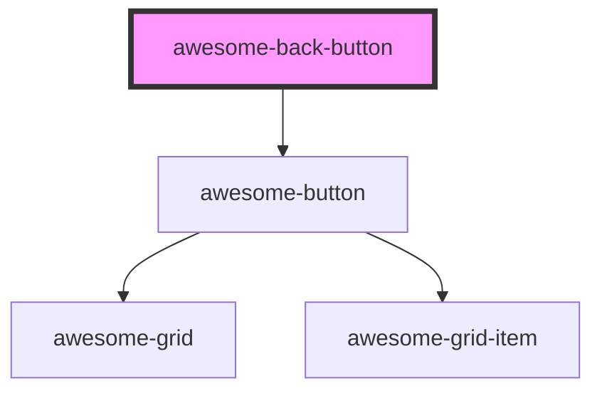

# awesome-back-button

<!-- Auto Generated Below -->

## Properties

| Property      | Attribute      | Description                                                    | Type     | Default     |
| ------------- | -------------- | -------------------------------------------------------------- | -------- | ----------- |
| `defaultHref` | `default-href` | The default href to be used when there is no browsing history. | `string` | `undefined` |

## Shadow Parts

| Part       | Description |
| ---------- | ----------- |
| `"button"` |             |

## Dependencies

### Depends on

- [awesome-button](../awesome-button)

### Graph

----------------------------------------------

*Built with [StencilJS](https://stenciljs.com/)*
