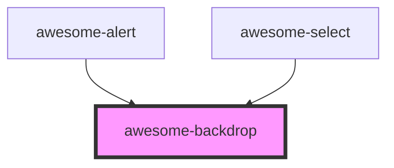

# awesome-backdrop

<!-- Auto Generated Below -->

## Properties

| Property | Attribute | Description             | Type     | Default |
| -------- | --------- | ----------------------- | -------- | ------- |
| `zIndex` | `z-index` | `z-index` of the alert. | `number` | `99`    |

## Dependencies

### Used by

 - [awesome-alert](../awesome-alert)
 - [awesome-select](../awesome-select)

### Graph

----------------------------------------------

*Built with [StencilJS](https://stenciljs.com/)*
