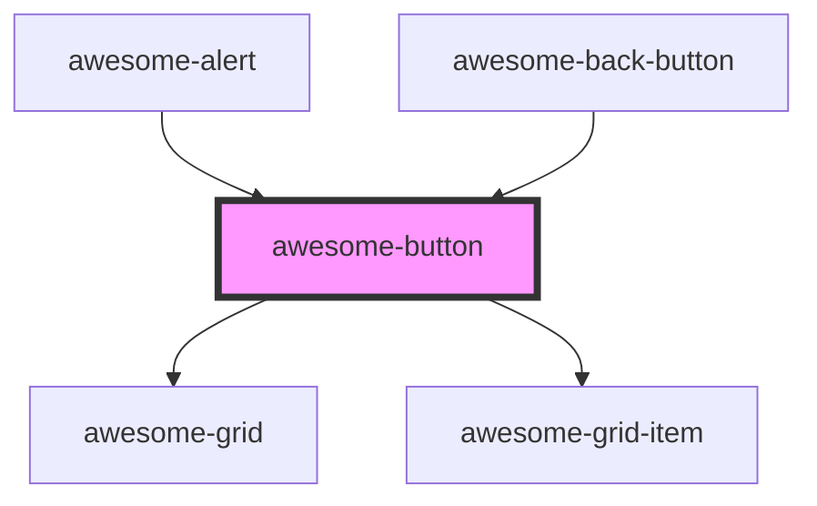

# awesome-button

<!-- Auto Generated Below -->

## Properties

| Property   | Attribute  | Description                                                               | Type                                                  | Default     |
| ---------- | ---------- | ------------------------------------------------------------------------- | ----------------------------------------------------- | ----------- |
| `disabled` | `disabled` | The flag of disabling the button. Default to `false`.                     | `boolean`                                             | `false`     |
| `href`     | `href`     | If presents, the button would act like an `a` tag using the given `href`. | `string`                                              | `undefined` |
| `variant`  | `variant`  | Variant of the button. Default to `solid`.                                | `"clear" \| "hollow" \| "link" \| "round" \| "solid"` | `'solid'`   |

## Dependencies

### Used by

 - [awesome-alert](../awesome-alert)
 - [awesome-back-button](../awesome-back-button)

### Depends on

- awesome-grid
- awesome-grid-item

### Graph

----------------------------------------------

*Built with [StencilJS](https://stenciljs.com/)*
