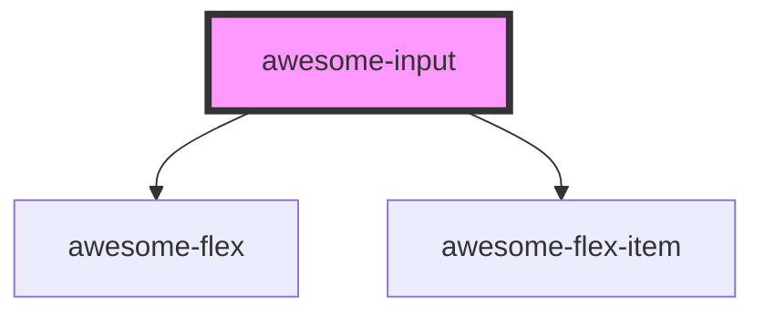

# awesome-input

<!-- Auto Generated Below -->

## Properties

| Property      | Attribute     | Description                                          | Type      | Default     |
| ------------- | ------------- | ---------------------------------------------------- | --------- | ----------- |
| `disabled`    | `disabled`    | The flag of disabling the input. Default to `false`. | `boolean` | `false`     |
| `placeholder` | `placeholder` | Placeholder of the input.                            | `string`  | `undefined` |
| `type`        | `type`        | Type of the input. Default to `text`.                | `"text"`  | `'text'`    |
| `value`       | `value`       | Value of the input.                                  | `string`  | `undefined` |

## Events

| Event           | Description                     | Type                                       |
| --------------- | ------------------------------- | ------------------------------------------ |
| `awesomeChange` | Event of content being changed. | `CustomEvent<[{ value: string; }, Event]>` |
| `awesomeInput`  | Event of something being input. | `CustomEvent<InputEvent>`                  |

## Dependencies

### Depends on

- awesome-flex
- awesome-flex-item

### Graph

----------------------------------------------

*Built with [StencilJS](https://stenciljs.com/)*
