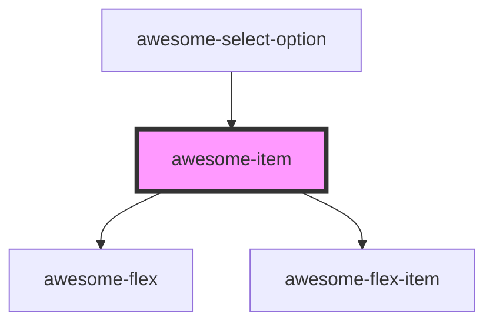

# awesome-item

<!-- Auto Generated Below -->

## Properties

| Property | Attribute | Description                                                                                       | Type      | Default     |
| -------- | --------- | ------------------------------------------------------------------------------------------------- | --------- | ----------- |
| `button` | `button`  | If `true`, the item would also act as a button. Default to `false`.                               | `boolean` | `false`     |
| `href`   | `href`    | If this presents and button is `true`, the item would act like an `a` tag using the given `href`. | `string`  | `undefined` |

## Shadow Parts

| Part     | Description |
| -------- | ----------- |
| `"main"` |             |

## Dependencies

### Used by

 - [awesome-select-option](../awesome-select-option)

### Depends on

- awesome-flex
- awesome-flex-item

### Graph

----------------------------------------------

*Built with [StencilJS](https://stenciljs.com/)*
