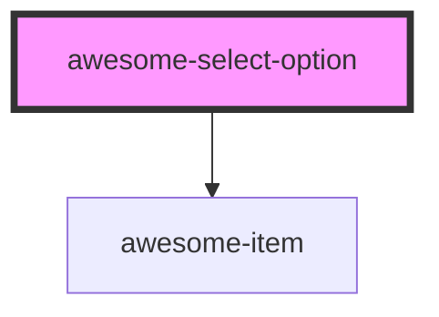

# awesome-select-option

<!-- Auto Generated Below -->

## Properties

| Property | Attribute | Description                 | Type     | Default     |
| -------- | --------- | --------------------------- | -------- | ----------- |
| `value`  | `value`   | Value of the select option. | `string` | `undefined` |

## Dependencies

### Depends on

- [awesome-item](../awesome-item)

### Graph

----------------------------------------------

*Built with [StencilJS](https://stenciljs.com/)*
