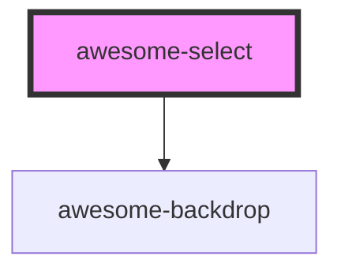

# awesome-select

<!-- Auto Generated Below -->

## Properties

| Property         | Attribute          | Description                          | Type     | Default          |
| ---------------- | ------------------ | ------------------------------------ | -------- | ---------------- |
| `dropdownZIndex` | `dropdown-z-index` | `z-index` of the dropdown.           | `number` | `99`             |
| `placeholder`    | `placeholder`      | Placehold when no value is selected. | `string` | `'No Selection'` |
| `value`          | `value`            | Value of the select.                 | `string` | `undefined`      |

## Events

| Event           | Description                   | Type                              |
| --------------- | ----------------------------- | --------------------------------- |
| `awesomeChange` | Event of value being changed. | `CustomEvent<{ value: string; }>` |

## Shadow Parts

| Part          | Description |
| ------------- | ----------- |
| `"backdrop"`  |             |
| `"container"` |             |
| `"dropdown"`  |             |
| `"main"`      |             |

## Dependencies

### Depends on

- [awesome-backdrop](../awesome-backdrop)

### Graph

----------------------------------------------

*Built with [StencilJS](https://stenciljs.com/)*
