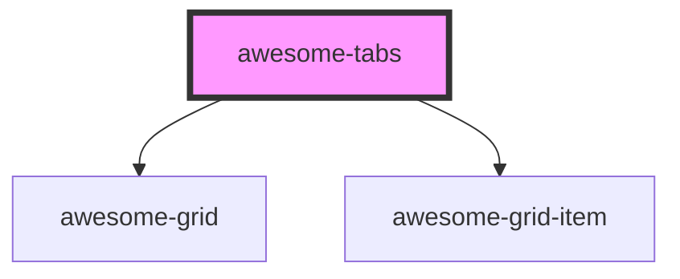

# awesome-tabs

<!-- Auto Generated Below -->

## Properties

| Property | Attribute | Description        | Type     | Default     |
| -------- | --------- | ------------------ | -------- | ----------- |
| `value`  | `value`   | Value of the tabs. | `string` | `undefined` |

## Events

| Event           | Description                   | Type                              |
| --------------- | ----------------------------- | --------------------------------- |
| `awesomeChange` | Event of value being changed. | `CustomEvent<{ value: string; }>` |

## Shadow Parts

| Part          | Description |
| ------------- | ----------- |
| `"container"` |             |
| `"highlight"` |             |

## Dependencies

### Depends on

- awesome-grid
- awesome-grid-item

### Graph

----------------------------------------------

*Built with [StencilJS](https://stenciljs.com/)*
